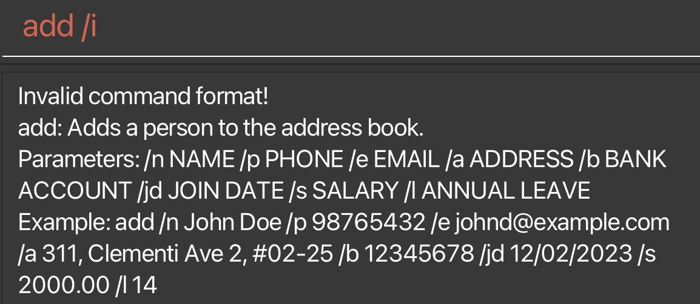
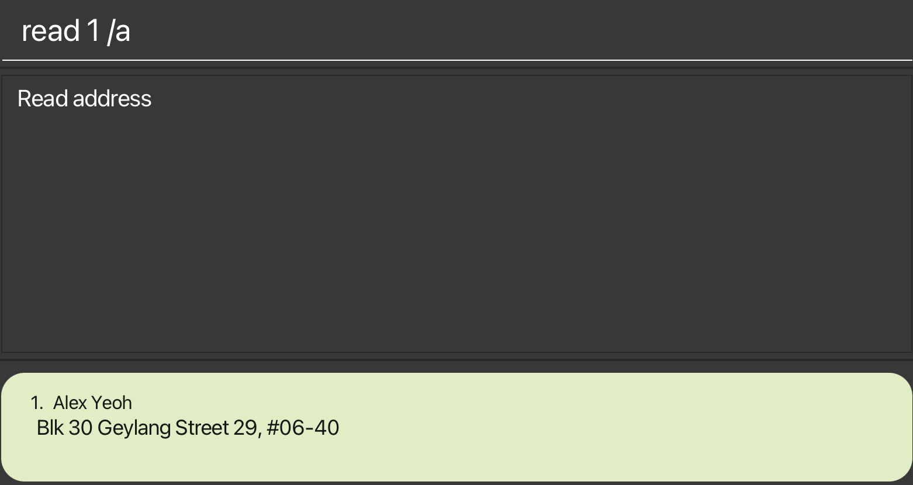
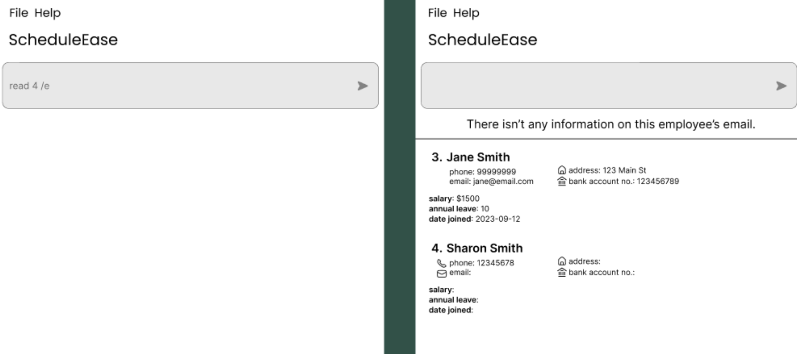

ManaGease is a **desktop app for managing full time staff in any workplace, optimized for use via a Command Line Interface** (CLI) while still having the benefits of a Graphical User Interface (GUI). If you can type fast, ManaGease can get your contact management tasks done faster than traditional apps.

--------------------------------------------------------------------------------------------------------------------

## Quick Start

1. Ensure you have Java `11` or above installed in your Computer. 
2. Download the latest `ManaGease.jar` from [here](https://github.com/AY2324S1-CS2103T-W12-2/tp/releases)
3. Copy the file to the folder you want to use as the _home folder_ for your ManaGease. 
4. Open a command terminal, `cd` into the folder you put the jar file in(i.e. `cd DIRECTORY_PATH`), and enter the `java -jar ManaGease.jar` command to run the application.<br>
   A GUI similar to the below should appear in a few seconds. Note how the app contains some sample data.<br>
   
5. Type the command in the command box and press Enter to execute it. e.g. typing **`help`** and pressing Enter will open the help window.<br>
   Some example commands you can try:

   * `list` : Lists all contacts.

   * `add /n Jane Smith /e jane@email.com /p 12345678 /a 123 Main St /b 123456789 /jd 2023-09-12 /s 1000 /al 10`: Adds an employee named `John Doe` to ManaGease

   * `delete 3` : Deletes the 3rd employee shown in the current list.
   
   * `read 3 /b` : Reads the bank account of the 3rd employee shown in the current list.
   
   * `edit 2 /n Betsy Crower` : Edits the name of the 2nd employee to be `Betsy Crower`.

   * `clear` : Deletes all employees.

   * `exit` : Exits the app.

Refer to the [Features](#features) below for details of each command.

--------------------------------------------------------------------------------------------------------------------

## Features

<div markdown="block" class="alert alert-info">

**:information_source: Notes about the command format:**<br>

* Words in `UPPER_CASE` are the parameters to be supplied by the user.<br>
  e.g. in `edit INDEX /n NAME`, `INDEX` and `NAME` are parameters which can be used as `edit 3 /n John Doe`.

* Items in square brackets are optional.<br>
  e.g `/n NAME [/t TAG]` can be used as `/n John Doe /t friend` or as `/n John Doe`.

* Items with `…`​ after them can be used multiple times including zero times.<br>
  e.g. `[/t TAG]…​` can be used as ` ` (i.e. 0 times), `/t friend`, `/t friend /t family` etc.

* Parameters can be in any order.<br>
  e.g. if the command specifies `/n NAME /p PHONE_NUMBER`, `/p PHONE_NUMBER /n NAME` is also acceptable.

* Extraneous parameters for commands that do not take in parameters (such as `help`, `list`, `exit` and `clear`) will be ignored.<br>
  e.g. if the command specifies `help 123`, it will be interpreted as `help`.

* If you are using a PDF version of this document, be careful when copying and pasting commands that span multiple lines as space characters surrounding line-breaks may be omitted when copied over to the application.
</div>

### Viewing help : `help` [Coming soon]
**What it does:**

Shows a message explaning how to access the help page.

**Command Format:**

`help`


### Adding a person: `add`

**What it does**

This feature allows users to add a new employee to the ManaGease app, creating a profile with essential details.

**Command format:**
```
add /n NAME [/e EMAIL] [/p PHONE] [/a ADDRESS] [/b BANK_ACCOUNT] [/jd JOIN_DATE] [/s SALARY] [/l ANNUAL_LEAVE]
```

<div markdown="span" class="alert alert-primary">:bulb: **Tip:**
A person must have at least the NAME parameter, but can have any number of parameters.
</div>

Example:
* `add /n Jane Smith /e jane@email.com /p 12345678 /a 123 Main St /b 123456789
  /jd 12/09/2023 /s 1000.00 /l 10`

Output:
* The ScheduleEase app should display a confirmation message indicating that the employee has been successfully added to the database. (e.g. `Employee "Jane Smith" successfully added!`)
* The employee's profile should be updated with the provided information.

* If prefix used is not defined, an error message will appear and say `Prefix not found, please use any of the following prefixes: /n, /e, /p, /a, /b, /jd, /s, /l`





### Editing a person : `edit`

**What it does**

Edits an existing person in the address book.

**Command Format:**

`edit INDEX [/n NAME] [/e EMAIL] [/p PHONE] [/a ADDRESS] [/b BANK_ACCOUNT] [/jd JOIN_DATE] [/s SALARY] [/l ANNUAL_LEAVE] `

* Edits the person at the specified `INDEX`. The index refers to the index number shown in the displayed person list. The index **must be a positive integer** 1, 2, 3, …​
* At least one of the optional fields must be provided.
* Existing values will be updated to the input values.

Examples:
*  `edit 1 /p 91234567 /e johndoe@example.com` Edits the phone number and email address of the 1st person to be `91234567` and `johndoe@example.com` respectively.
*  `edit 2 /n Betsy Crower ` Edits the name of the 2nd person to be `Betsy Crower` and clears all existing tags.

Output:
* The ScheduleEase app should display a confirmation message indicating that the employee information has been successfully updated, specifying the part that has been updated.
  
* The employee's profile should be updated with the provided information.
  
* `Employee 3’s information successfully updated!`


### Deleting a person : `delete`

**What it does**

This feature allows users to delete an employee based on index or name.

**Command Format**

`delete INDEX` or `delete /n NAME`


* Deletes the person at the specified `INDEX` or with the name `NAME`.
* The index refers to the index number shown in the displayed person list.
* The index **must be a positive integer**.

Examples:
* `list` followed by `delete 2` deletes the 2nd employee in the employee directory.
* `find Betsy` followed by `delete 1` deletes the 1st employee in the results of the `find` command.

Output:
* If there are multiple employees with the same name, we just list down the employees for them to view, return “Here is the list of the matching employees:”
  
* Otherwise, the ScheduleEase app should display a confirmation message indicating that the employee information has been successfully deleted. 
  * Specifying the part that has been updated
    
  * `Employee “Jane Smith” has been removed`
    
* The employee's list should be updated by removing the employee.


### Reading a person's information : `read`

**What it does**

This feature allows users to view specific information about an employee.

**Command Format**

`read INDEX PREFIX`

* Reads the person's information specified by the `PREFIX` at the specified `INDEX`.
* The index refers to the index number shown in the displayed person list.
* The index **must be a positive integer**.

Examples:
* `read 3 /e` reads the email of the third person in the most recently displayed list.

Output:

* If the index is not within the numbers in the list, the app should display `Please enter a valid index number`.
  
* If the command is incorrect, the app should display `Please use the following format to read information : read INDEX INFORMATION`.
  
* If the `PREFIX` provided is not in the list, the app should display `Please provide a valid information prefix to read`.
  
* If the `PREFIX` has not been stored in the list, the app should display `There isn’t any information on this employee’s specified PREFIX`.






### Listing all persons : `list` [Coming soon]

**What it does**

Shows a list of all employees in the workplace.

**Command format:**

`list`

### Clearing all entries : `clear` [Coming soon]

**What it does**

Clears all entries from the address book.

**Command format:**
`clear`

### Locating employees by name: `find` [Coming soon]

**What it does**

Finds employees whose names contain any of the given keywords.

**Command Format**

`find KEYWORD [MORE_KEYWORDS]`

* The search is case-insensitive. e.g `hans` will match `Hans`
* The order of the keywords does not matter. e.g. `Hans Bo` will match `Bo Hans`
* Only the name is searched.
* Only full words will be matched e.g. `Han` will not match `Hans`
* Persons matching at least one keyword will be returned (i.e. `OR` search).
  e.g. `Hans Bo` will return `Hans Gruber`, `Bo Yang`

Examples:
* `find John` returns `john` and `John Doe`
* `find alex david` returns `Alex Yeoh`, `David Li`<br>
  


### Exiting the program : `exit` 

**What it does**

Exits the program.

**Command format:**

`exit`

### Saving the data

AddressBook data are saved in the hard disk automatically after any command that changes the data. There is no need to save manually.

### Editing the data file

ManaGease data are saved automatically as a JSON file `[JAR file location]/data/managease.json`. Advanced users are welcome to update data directly by editing that data file.

<div markdown="span" class="alert alert-warning">:exclamation: **Caution:**
If your changes to the data file makes its format invalid, Managease will discard all data and start with an empty data file at the next run. Hence, it is recommended to take a backup of the file before editing it.
</div>

### Archiving data files `[coming in v2.0]`

_Details coming soon ..._

--------------------------------------------------------------------------------------------------------------------

## FAQ

**Q**: How do I transfer my data to another Computer?<br>
**A**: Install the app in the other computer and overwrite the empty data file it creates with the file that contains the data of your previous ManaGease home folder.

--------------------------------------------------------------------------------------------------------------------

## Known issues

1. **When using multiple screens**, if you move the application to a secondary screen, and later switch to using only the primary screen, the GUI will open off-screen. The remedy is to delete the `preferences.json` file created by the application before running the application again.

--------------------------------------------------------------------------------------------------------------------

## Command summary

| Action     | Format, Examples                                                                                                                                                                                                                   |
|------------|------------------------------------------------------------------------------------------------------------------------------------------------------------------------------------------------------------------------------------|
| **Add**    | `add /n NAME [/e EMAIL] [/p PHONE] [/a ADDRESS] [/b BANK_ACCOUNT] [/jd JOIN_DATE] [/s SALARY] [/l ANNUAL_LEAVE]`     <br> e.g., `add n/James Ho p/22224444 e/jamesho@example.com a/123, Clementi Rd, 1234665 t/friend t/colleague` |
| **Clear**  | `clear`                                                                                                                                                                                                                            |
| **Delete** | `delete INDEX`<br> e.g., `delete 3`                                                                                                                                                                                                |
| **Edit**   | `edit INDEX [/n NAME] [/e EMAIL] [/p PHONE] [/a ADDRESS] [/b BANK_ACCOUNT] [/jd JOIN_DATE] [/s SALARY] [/l ANNUAL_LEAVE]`<br> e.g.,`edit 2 n/James Lee e/jameslee@example.com`                                                     |
| **Read**   | `read INDEX PREFIX`<br> e.g., `read 3 /n`                                                                                                                                                                                          |
| **List**   | `list`                                                                                                                                                                                                                             |
| **Help**   | `help`                                                                                                                                                                                                                             |
